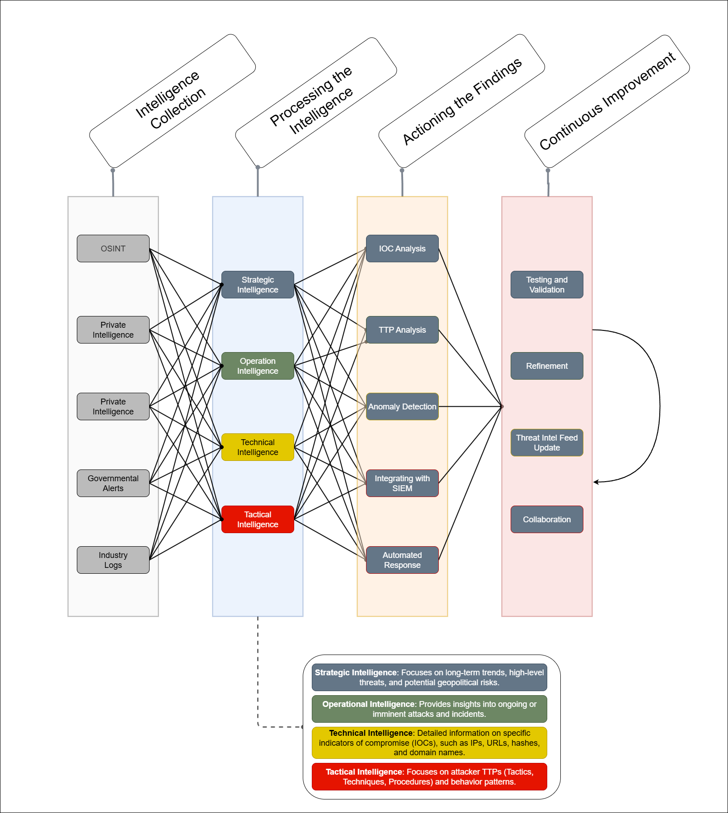

# Threat Intelligence Process

This document describes the process of gathering, processing, and actioning threat intelligence to enhance detection and response capabilities in an enterprise environment. The process is broken down into key stages: **Intelligence Collection**, **Processing the Intelligence**, **Actioning the Findings**, and **Continuous Improvement**.

## 1. Intelligence Collection

The first step is gathering threat intelligence from a variety of sources, both internal and external. These include:

### External Sources:
- **Open-Source Intelligence (OSINT)**: Threat intelligence gathered from publicly available sources such as blogs, forums, and social media.
- **Private Threat Feeds**: Subscription-based feeds from providers like **CrowdStrike** and **FireEye**.
- **Government and Industry Alerts**: Reports from organizations like **CISA** and **US-CERT**.
- **Dark Web**: Intelligence from closed forums or the dark web where cybercriminals may trade tools or data.

### Internal Sources:
- **SIEM Logs**: Logs from tools like **Splunk** and **Elastic SIEM**.
- **EDR**: Data from endpoint detection systems such as **CrowdStrike Falcon** and **SentinelOne**.
- **Firewalls/IDS/IPS**: Logs from intrusion detection/prevention systems.

### Action:
- All intelligence collected is ingested into the organization's central **Threat Intelligence Platform (TIP)** or **SIEM**.

## 2. Processing the Intelligence

After gathering the intelligence, it must be processed to transform raw data into usable insights:

### Key Steps:
- **Normalization**: Transforming data into a standard format, often using **STIX** and **TAXII**.
- **Contextualization**: Enriching data with context, linking to known threat actors and using **MITRE ATT&CK** techniques.
- **Threat Intelligence Enrichment**: Cross-referencing with databases like **VirusTotal** and **Anomali**.
- **Threat Intelligence Analysis**: Identifying trends, patterns, and specific adversary tactics.

### Action:
- The processed intelligence is stored in a structured format (e.g., **STIX**, **JSON**) and is ready for integration into detection systems.

## 3. Actioning the Findings – Detection and Response

The final step involves turning the processed intelligence into actionable detections and responses:

### Detection Methods:
- **IOC-Based Detection**: Creating rules in tools like **Sigma** and **Splunk**.
- **TTP-Based Detection**: Focusing on **MITRE ATT&CK** TTPs to detect adversary behaviors.
- **Anomaly Detection**: Using machine learning to detect deviations from normal behavior.

### Integration:
- The detection rules are integrated into SIEM systems, and automated responses are initiated using **SOAR** platforms (e.g., **Cortex XSOAR**, **Swimlane**).

## 4. Continuous Improvement – Feedback Loop

To ensure the effectiveness of threat intelligence, the process includes regular testing and refinement:

### Key Activities:
- **Testing and Validation**: Regularly testing detection rules using red team exercises or tools like **Atomic Red Team**.
- **Refinement**: Adjusting detection rules based on feedback and emerging threats.
- **Collaboration**: Sharing findings with external organizations through ISACs and other threat intelligence-sharing platforms.

---

This image illustrates the stages of the threat intelligence lifecycle: **Intelligence Collection**, **Processing the Intelligence**, **Actioning the Findings**, and **Continuous Improvement**, and how each of these steps is interlinked with various intelligence types (Strategic, Operational, Technical, and Tactical).

By following these steps, organizations can effectively enhance their threat detection capabilities and continuously improve their defenses.

---

## References

1. **MITRE ATT&CK Framework**  
   MITRE ATT&CK. (2021). *MITRE ATT&CK®: Adversarial Tactics, Techniques, and Procedures*. Retrieved from [https://attack.mitre.org/](https://attack.mitre.org/)

2. **STIX (Structured Threat Information eXpression)**  
   OASIS. (2021). *STIX™ 2.1 (Structured Threat Information Expression)*. Retrieved from [https://oasis-open.github.io/cti-documentation/](https://oasis-open.github.io/cti-documentation/)

3. **TAXII (Trusted Automated Exchange of Indicator Information)**  
   OASIS. (2021). *TAXII™ 2.1 (Trusted Automated Exchange of Indicator Information)*. Retrieved from [https://oasis-open.github.io/taxii/](https://oasis-open.github.io/taxii/)

4. **Sigma: Open Source Detection Rules**  
   SigmaHQ. (2021). *Sigma Rules - Open Source Format for SIEM Detection*. Retrieved from [https://github.com/SigmaHQ/sigma](https://github.com/SigmaHQ/sigma)

5. **VirusTotal: Threat Intelligence Platform**  
   VirusTotal. (2021). *VirusTotal - Free Malware Analysis, Detection, and Threat Intelligence*. Retrieved from [https://www.virustotal.com/](https://www.virustotal.com/)

6. **Cortex XSOAR (SOAR platform)**  
   Palo Alto Networks. (2021). *Cortex XSOAR: Security Orchestration, Automation, and Response*. Retrieved from [https://www.paloaltonetworks.com/cortex/xsoar](https://www.paloaltonetworks.com/cortex/xsoar)

7. **CISA: Cybersecurity & Infrastructure Security Agency**  
   CISA. (2021). *Cybersecurity & Infrastructure Security Agency (CISA) Alerts*. Retrieved from [https://www.cisa.gov/uscert/ncas/alerts](https://www.cisa.gov/uscert/ncas/alerts)

8. **Atomic Red Team**  
   Red Canary. (2021). *Atomic Red Team: Security Testing Framework*. Retrieved from [https://github.com/redcanaryco/atomic-red-team](https://github.com/redcanaryco/atomic-red-team)

9. **Anomali Threat Intelligence Platform**  
   Anomali. (2021). *Anomali Threat Intelligence Platform*. Retrieved from [https://www.anomali.com/](https://www.anomali.com/)

10. **Elastic Security**  
    Elastic. (2021). *Elastic Security: Threat Detection and Response*. Retrieved from [https://www.elastic.co/security](https://www.elastic.co/security)
